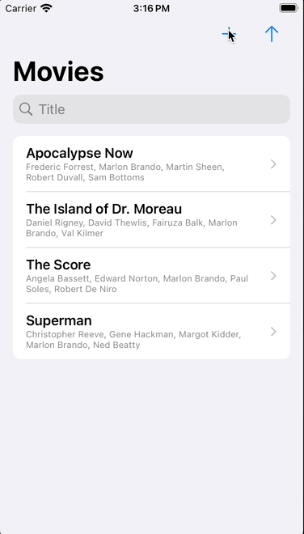

# Introduction

This is a simple app that uses SwiftUI for views, [The Composable Architecture v1.11.2
(TCA)](https://github.com/pointfreeco/swift-composable-architecture) framework for managing logic and state, and
[GRDB](https://github.com/groue/GRDB.swift) for backend storage. This was originally a branch of my
[SwiftDataTCA](https://github.com/bradhowes/SwiftDataTCA) app that I used for experimenting with SwiftData, but
switching the branches was a pain with Xcode, so a new repo it is.

The code here is using the `@SharedReader` feature described in [Point•Free](https://pointfree.co) episodes about GRDB
-- a version of this macro can be found in the
[GRDBDemo](https://github.com/pointfreeco/swift-sharing/tree/main/Examples/GRDBDemo) app of their
[swift-sharing](https://github.com/pointfreeco/swift-sharing) package. Works pretty well!

# Overview

The code contains a top-level TCA "feature" (combination of a reducer and a SwiftUI view) called
[FromStateFeature](swiftui-grdb-tca/Views/FromState/FromStateFeature.swift). It shows a list of movies
and the names of the actors associated with the movie.

From this view you can:

* Add a new "random" movie
* Sort movies by title
* Search by title content
* Swipe to mark as a favorite
* Swipe to delete a movie
* Select a movie to "drill-down" to a list of actors. This view too supports "drilling-down" to see the actor's movies. This can
be done as much as you want, though unwinding gets to be a bit tiring.

Per TCA guidance, all UI activity lead to reducer actions that are performed in the feature's reducer logic, updating
internal feature state when necessary to cause a UI update.

## Drilling Down

The top-level view [FromStateView](SwiftGRDBTCA/Views/FromState/FromStateView.swift) start with a TCA `NavigationStack`
view builder. The subsequent `List` views define `NavigationLink` elements for each movie or actor in the view. These
drive the transitions into the next view, and record the path for the `Back` button to follow when moving back up.

The top-level reducer in `FromtStateView` monitors for `path` actions and handles the selections made by the child
views, [ActorMoviesView](SwiftGRDBTCA/Views/ActorMoviesFeature/ActorMoviesView.swift) and
[MovieActorsView](SwiftGRDBTCA/Views/MovieActorsFeature/MovieActorsView.swift). This is pretty much as what is
documented on TCA's [Pushing Features onto the
Stack](https://pointfreeco.github.io/swift-composable-architecture/main/documentation/composablearchitecture/stackbasednavigation#Pushing-features-onto-the-stack)
page.

Each of the drill-down views can also change the favorite state of a movie, either via toolbar button in the
`MovieActorsView` view, or by swiping in the `ActorMoviesView` view. When a parent view comes back into view, it should
already show any changaes that were made in a child view.

## Previews

The SwiftUI previews operate pretty much like in the simulator or on a physical device.

## GRDB Use

All GRDB activity is driven by activity the feature reducers. Each state uses a `@SharedReader` property wrapper for a
container. This property is initialized with a GRDB query that will return a value for the container. When properties change that
affect the query, state activity will invoke `updateQuery` to update the `@SharedReader` query. This in turn will cause the view to 
refresh if there are any updates.

The app communicates to its GRDB database by means of a DatabaseQueue instance that is available via the
`@Dependency(\.defaultDatabase)` attribute.

## Schemas

Unlike the SwiftDataTCA app, there is currently just 1 schema defined in the `Models` package in the file
[Schemav1.swift](SwiftGRDBTCA/Packages/Sources/Models/SchemaV1.swift) file. The schema contains the GRDB Swift
structs that map to SQL table definitions. Although this is not as concise as the case with SwiftData, it is also much
less mysterious -- properties and relationships are spelled out in very readable form, and there is always the option to
drop down into raw SQL if need be. For instance, this schema supports searching of the movie titles using the full-text 
search facility in the FTS5 extension.

## Tests

There are some...
